  #  TP2 — Application Web Java Multi-VM : Vagrant + Tomcat 9 + MySQL


> Déploiement d'une architecture **2-tiers** : une VM applicative (`srv-app`) hébergeant Tomcat 9 + une app Java Web, et une VM base de données (`srv-db`) hébergeant MySQL 8. Les deux VMs communiquent via un réseau privé Vagrant.


---

---

##  Structure du projet

| 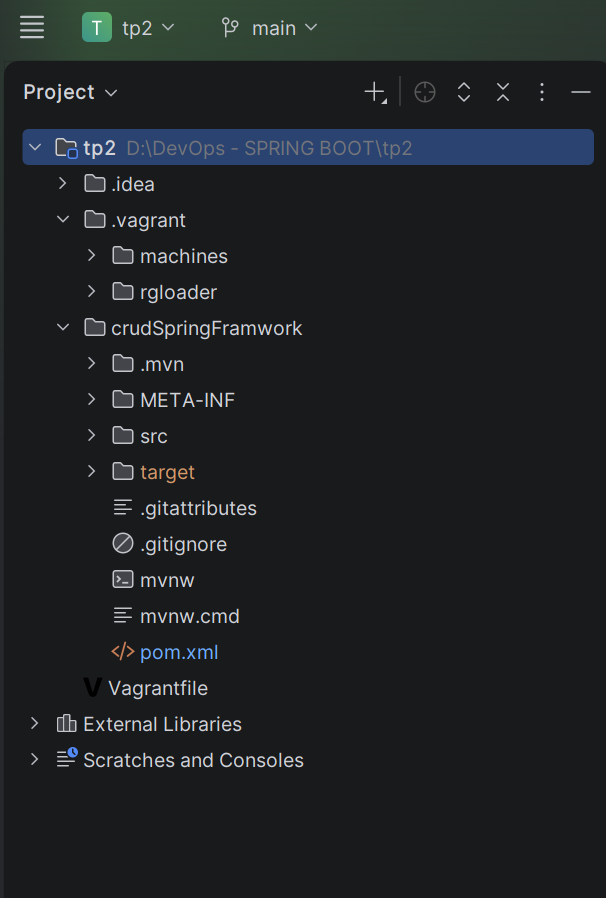 |

---

---

## Création des VMs Vagrant

### Vagrantfile (2 VMs)

```ruby
Vagrant.configure("2") do |config|
  config.vm.box = "ubuntu/focal64"
  config.vm.box_check_update = false   

 
  # Machine srv-app (application)
  
  config.vm.define "srv-app" do |app|
    app.vm.hostname = "srv-app"
    # Réseau privé avec IP fixe
    app.vm.network "private_network", ip: "192.168.56.10"
    # Redirection du port 8080 de la VM vers le port 8080 de l'hôte (pour Tomcat)
    app.vm.network "forwarded_port", guest: 8080, host: 8080
    # Configuration VirtualBox
    app.vm.provider "virtualbox" do |vb|
      vb.memory = "2048"
      vb.cpus = 2
      vb.name = "srv-app"
    end
  end

  # Machine srv-db (base de données)
  config.vm.define "srv-db" do |db|
    db.vm.hostname = "srv-db"
    db.vm.network "private_network", ip: "192.168.56.11"
    db.vm.provider "virtualbox" do |vb|
      vb.memory = "1024"
      vb.cpus = 1
      vb.name = "srv-db"
    end
   
  end
end

```

### Démarrage des VMs

```bash
vagrant up           # Démarre et provisionne les 2 VMs
vagrant status       # Vérifie que les 2 VMs sont running
```

---

## Installation JDK & Tomcat 9

### Connexion SSH

```bash
vagrant ssh srv-app
# vagrant@srv-app:~$
```

| Capture | Description |
|---------|-------------|
| 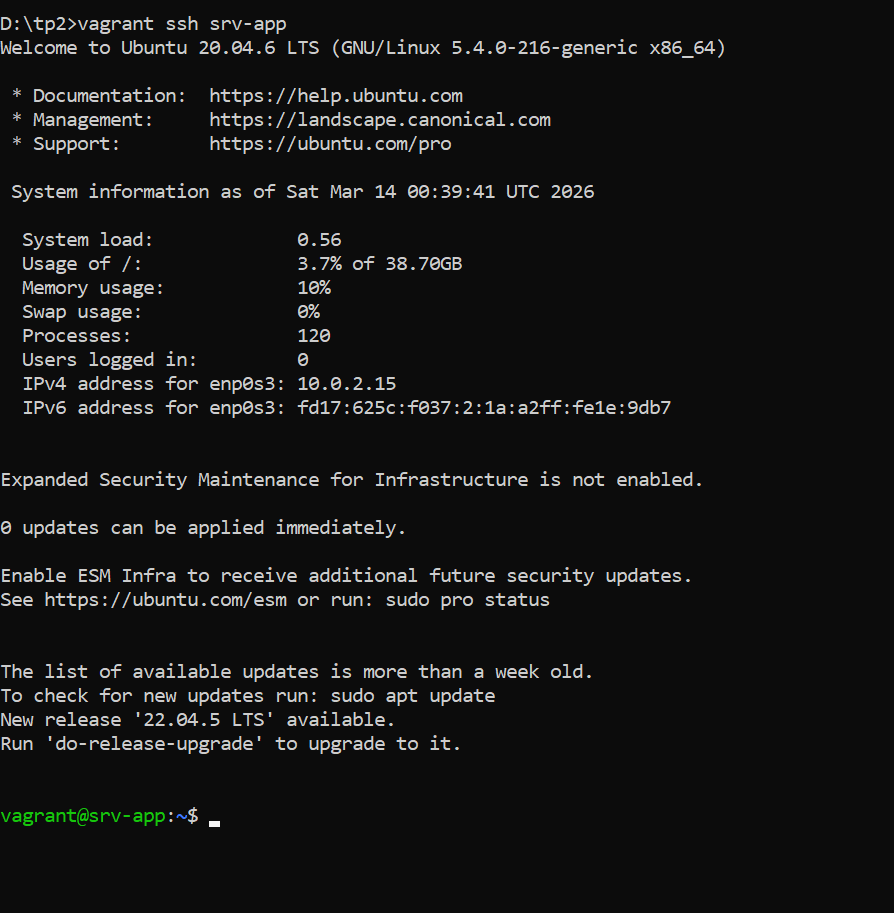 | Connexion SSH à srv-app |


### Installation des JDK 8, 11, 17
 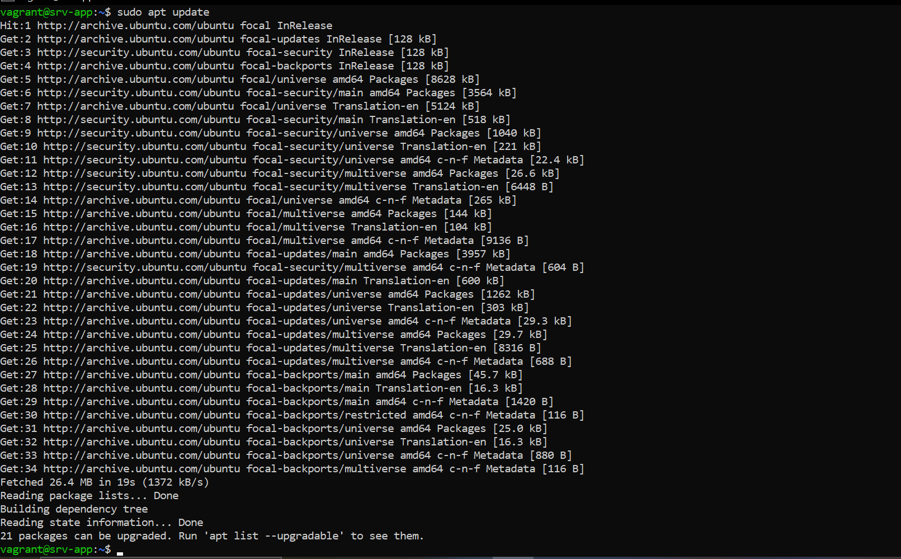  
 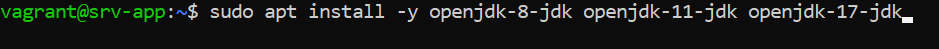 

### Vérification JDK 8, 11, 17
 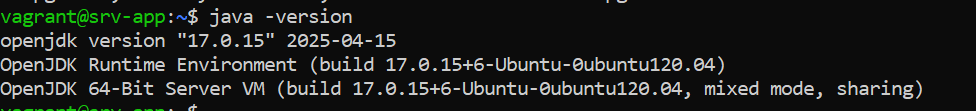 

### Définissez JAVA_HOME
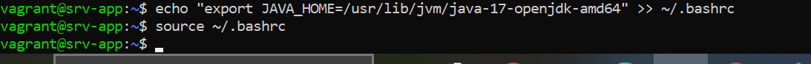 

### Vérification Tomcat 9

## Installation de Tomcat 9
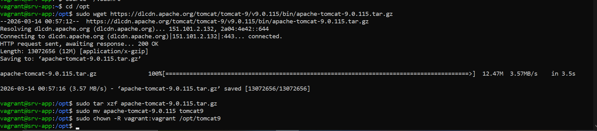 

## Ajoutez les variables d'environnement
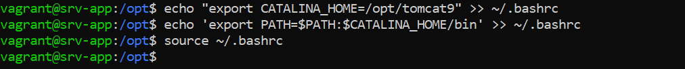 

## Installation de Maven (pour builder le projet)
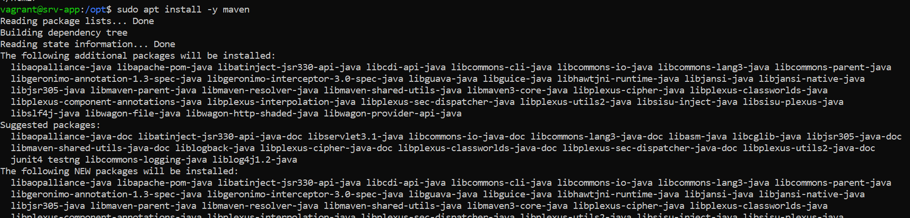 
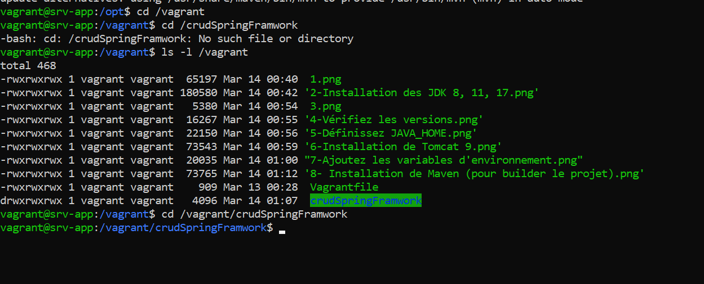 
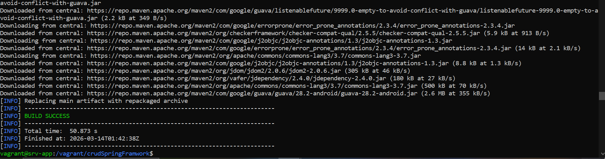 

## Déployer l'application dans Tomcat
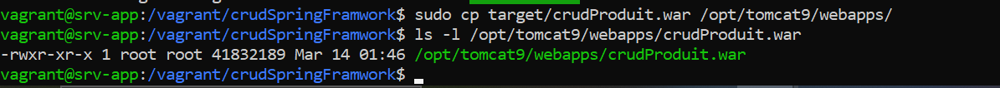 

---

## srv-db : Installation et Configuration MySQL

### Connexion SSH à srv-db

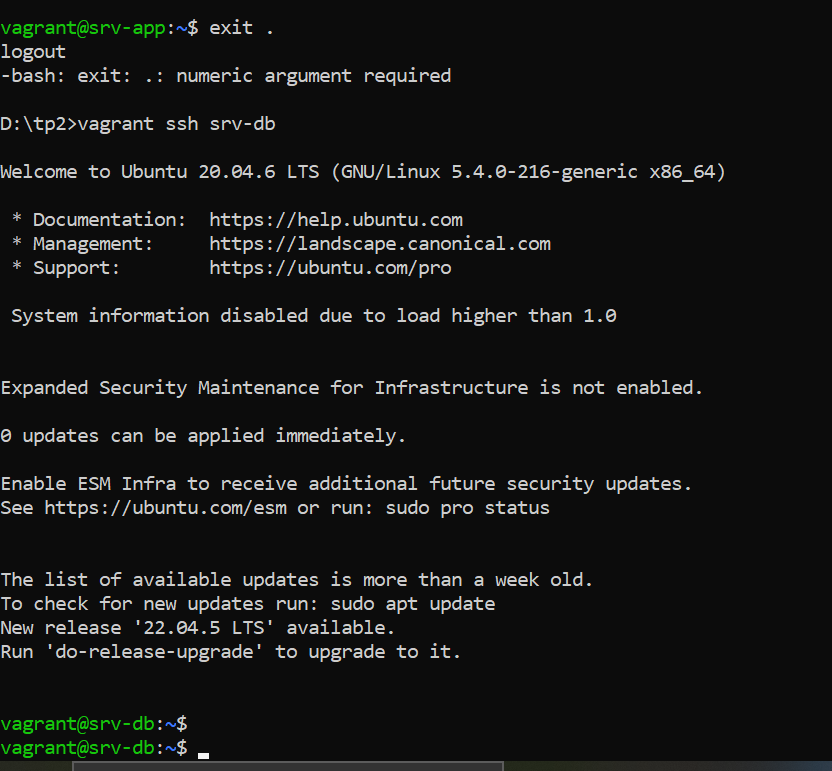 


### Vérification MySQL

## Installation de MySQL

 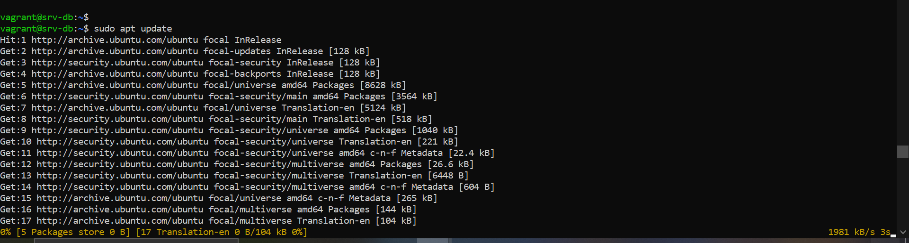 
 # sudo apt install mysql-server -y
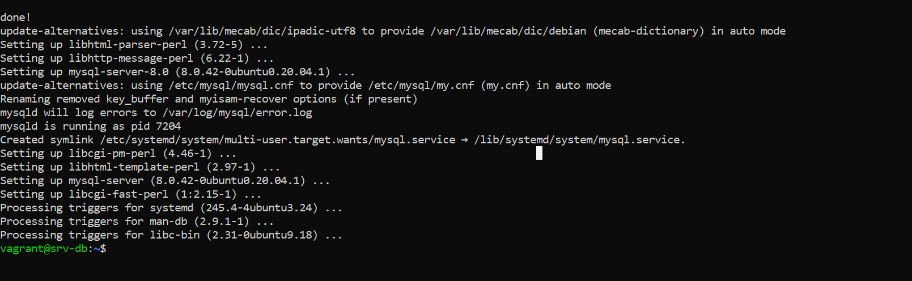 

## Lancez le service et activez-le au démarrage
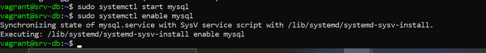 

## Création de la base de données

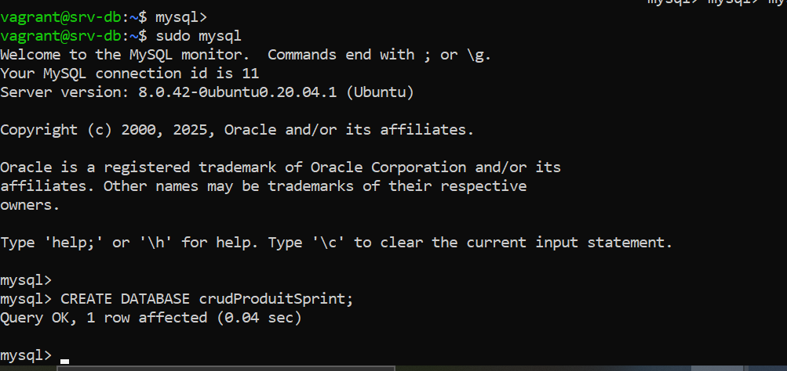 

## Testez la connexion

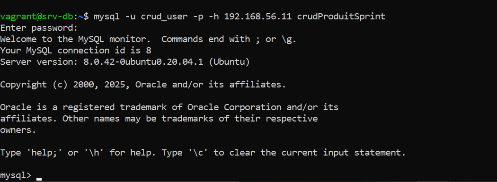 

## Installer le client MySQL sur srv-app
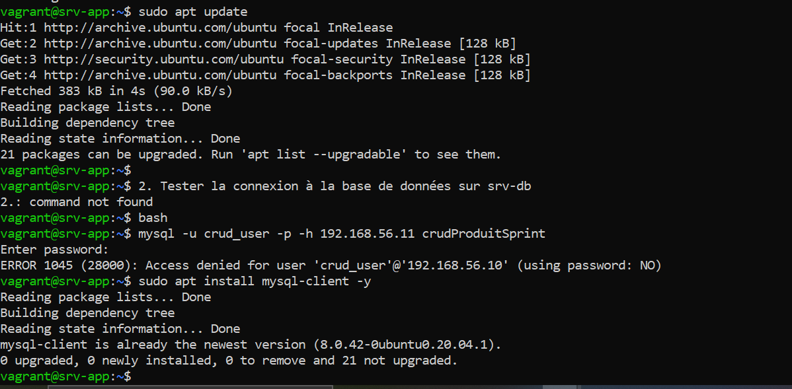 

## Vérifier que Tomcat a bien redémarré,Build et déploiement


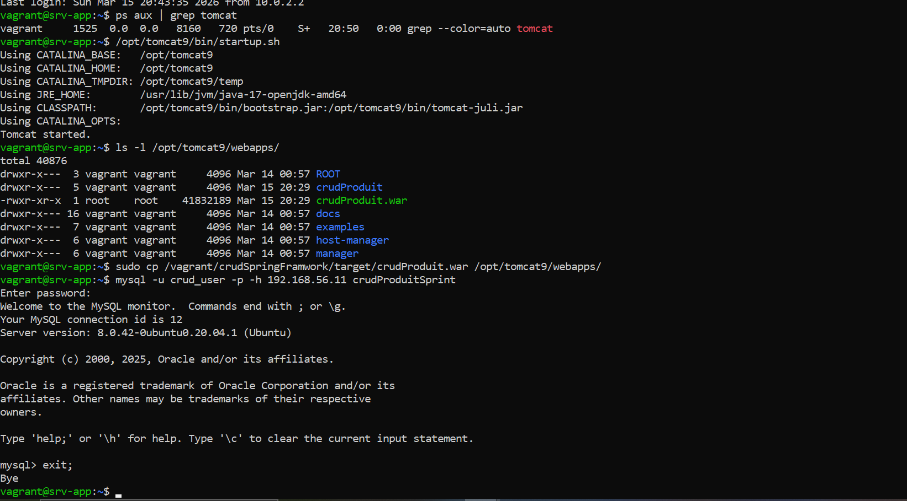 

---

##  Déploiement de l'Application Java Web

### Structure Maven (`pom.xml`)

```xml

   <?xml version="1.0" encoding="UTF-8"?>
<project xmlns="http://maven.apache.org/POM/4.0.0"
         xmlns:xsi="http://www.w3.org/2001/XMLSchema-instance"
         xsi:schemaLocation="http://maven.apache.org/POM/4.0.0 
         https://maven.apache.org/xsd/maven-4.0.0.xsd">
    <modelVersion>4.0.0</modelVersion>

    <parent>
        <groupId>org.springframework.boot</groupId>
        <artifactId>spring-boot-starter-parent</artifactId>
        <version>2.7.0</version>   
        <relativePath/>
    </parent>

    <groupId>sn.dev</groupId>
    <artifactId>crudProduit</artifactId>
    <version>0.0.1-SNAPSHOT</version>
    <packaging>war</packaging>
    <name>crudProduit</name>
    <description>Application Spring Boot avec MySQL déployée sur Tomcat</description>

    <properties>
        <java.version>17</java.version>
    </properties>

    <dependencies>
        <!-- Spring MVC -->
        <dependency>
            <groupId>org.springframework.boot</groupId>
            <artifactId>spring-boot-starter-web</artifactId>
        </dependency>

        <!-- Pour le déploiement en WAR sur Tomcat externe -->
        <dependency>
            <groupId>org.springframework.boot</groupId>
            <artifactId>spring-boot-starter-tomcat</artifactId>
            <scope>provided</scope>
        </dependency>

        <!-- Spring Data JPA -->
        <dependency>
            <groupId>org.springframework.boot</groupId>
            <artifactId>spring-boot-starter-data-jpa</artifactId>
        </dependency>

        <!-- Driver MySQL -->
        <dependency>
            <groupId>mysql</groupId>
            <artifactId>mysql-connector-java</artifactId>
            <scope>runtime</scope>
        </dependency>

        <!-- Thymeleaf (optionnel) -->
        <dependency>
            <groupId>org.springframework.boot</groupId>
            <artifactId>spring-boot-starter-thymeleaf</artifactId>
        </dependency>

        <!-- Validation (optionnel) -->
        <dependency>
            <groupId>org.springframework.boot</groupId>
            <artifactId>spring-boot-starter-validation</artifactId>
        </dependency>

        <!-- Tests (optionnel) -->
        <dependency>
            <groupId>org.springframework.boot</groupId>
            <artifactId>spring-boot-starter-test</artifactId>
            <scope>test</scope>
        </dependency>
    </dependencies>

    <build>
        <finalName>crudProduit</finalName>
        <plugins>
            <plugin>
                <groupId>org.springframework.boot</groupId>
                <artifactId>spring-boot-maven-plugin</artifactId>
            </plugin>
        </plugins>
    </build>
</project>
```
## structure du projet back

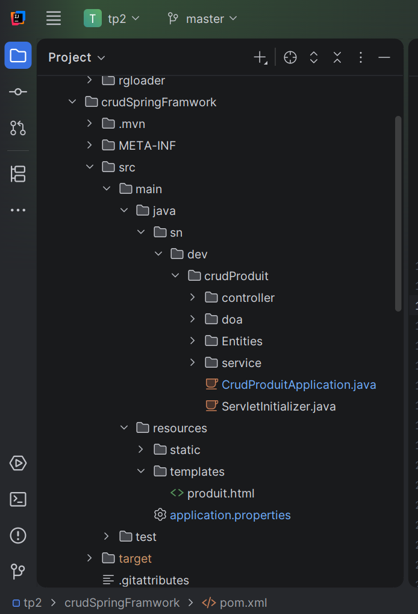 


### Build et déploiement

## l'application est  déployé une application web Java avec base de données MySQL sur deux VM distinctes
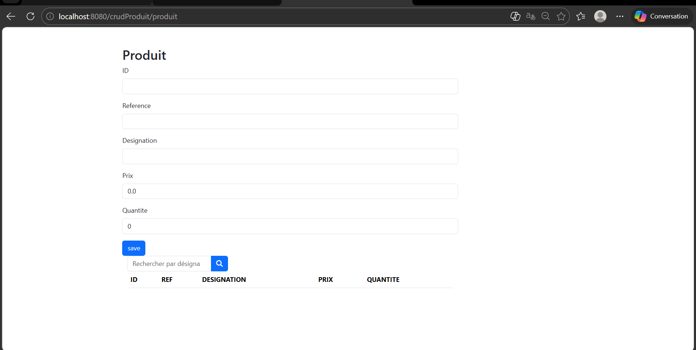 
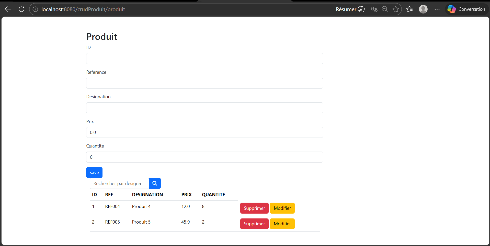 

---

## Tests de connexion et validation

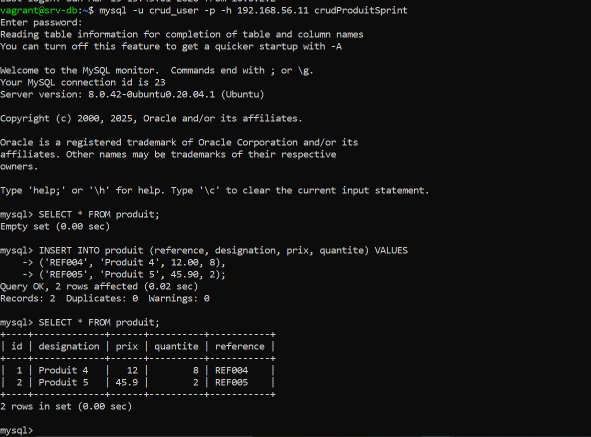 

##  Commandes utiles

```bash
# Vagrant 
vagrant up              # Démarrer les 2 VMs
vagrant up srv-app      # Démarrer une VM spécifique
vagrant halt            # Éteindre toutes les VMs
vagrant ssh srv-app     # SSH sur srv-app
vagrant ssh srv-db      # SSH sur srv-db
vagrant status          # Voir l'état des VMs
vagrant destroy -f      # Supprimer toutes les VMs
vagrant reload --provision  # Reprovisionner

#  Tomcat (depuis srv-app) 
sudo systemctl start|stop|restart|status tomcat
sudo tail -f /opt/tomcat9/logs/catalina.out
ls /opt/tomcat9/webapps/

#  MySQL (depuis srv-db) 
sudo systemctl start|stop|status mysql
sudo mysql -u root
mysql -u appuser -p'AppPass@2024' -h 192.168.56.20 appdb

# Build Maven (depuis srv-app) 
cd /vagrant/app
mvn clean package -DskipTests
sudo cp target/myapp-1.0.war /opt/tomcat9/webapps/myapp.war
```

---

##  Licence

Distribué sous licence MIT.

---

*TP2 réalisé dans le cadre du cours DevOps *
